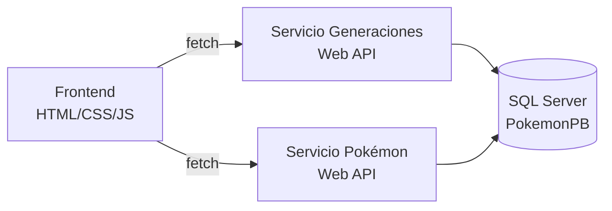

# Pokémon por Generación – Web API .NET + SQL Server + Microservicios

Aplicación web donde el usuario elige una **generación** y ve una **tabla** con los Pokémon de esa generación (tipo, habilidad, naturaleza, objeto, rol, movimientos e imágenes).

## Tecnologías

| Capa | Tecnología | Para qué sirve |
|---|---|---|
| Base de datos | SQL Server 2025 + SSMS | Guarda los datos de forma relacional |
| Backend | ASP.NET Core Web API (Visual Studio) | Expone los datos como endpoints HTTP en formato JSON |
| Acceso a datos | Entity Framework Core | ORM: traduce tablas SQL a clases C# y consultas LINQ a SQL |
| Frontend | HTML, CSS, JavaScript | Interfaz: selector de generación y tabla de resultados |
| Arquitectura | Microservicios | Divide el sistema en servicios pequeños e independientes |

## Arquitectura



Cada microservicio es un proyecto Web API propio, con una sola responsabilidad. Si uno falla o se actualiza, el otro sigue funcionando.

## Base de datos (PokemonPB)

Los datos salen de `PokemonGen.csv` (108 Pokémon, 18 generaciones, 6 por generación) y se normalizaron en estas tablas:

| Tabla | Contenido | Relación |
|---|---|---|
| `Generaciones` | Gen I, Gen II, … | 1 generación → muchos Pokémon |
| `Pokemon` | Nombre, habilidad, naturaleza, objeto, rol | FK `GeneracionId` |
| `Tipos` | Agua, Fuego, Psíquico… | Muchos a muchos vía `PokemonTipos` |
| `Movimientos` | Surf, Terremoto… | Muchos a muchos vía `PokemonMovimientos` |
| `PokemonImagenes` | Nombre de archivo de imagen | 1 Pokémon → muchas imágenes |

**Normalización:** en el CSV una celda tenía varios valores (`"Agua, Psíquico"`). En SQL cada valor va en su propia fila y se unen con **tablas intermedias**; así no se repiten datos.

> Nota: en el CSV cada fila viene envuelta entre comillas y varias generaciones solo tienen el tipo lleno. Revisa esto al importar.

## Modelos (Database First)

Las clases se generaron desde la base existente con *scaffolding*:

```bash
Scaffold-DbContext "Name=ConnectionStrings:PokemonPBConnection" Microsoft.EntityFrameworkCore.SqlServer -OutputDir Models -DataAnnotations
```

- `Pokemon.cs`: entidad con `[Key]`, `[StringLength]`, `[ForeignKey]` y propiedades de navegación (`Generacion`, `Tipos`, `Movimientos`, `PokemonImagenes`).
- `PokemonPBContext.cs`: el **DbContext**, puente entre C# y SQL Server. Define los `DbSet` (tablas) y en `OnModelCreating` configura llaves y relaciones muchos a muchos.

La cadena de conexión va en `appsettings.json`:

```json
"ConnectionStrings": {
  "PokemonPBConnection": "Server=localhost;Database=PokemonPB;Trusted_Connection=True;TrustServerCertificate=True"
}
```

## Endpoints

| Método | Ruta | Servicio | Devuelve |
|---|---|---|---|
| GET | `/api/generaciones` | Generaciones | Lista para el `<select>` |
| GET | `/api/pokemon/generacion/{id}` | Pokémon | Pokémon de esa generación con tipos, movimientos e imágenes |

Se usan **DTOs** (objetos simples) en la respuesta para evitar ciclos en el JSON causados por las relaciones de navegación, y `.Include()` para cargar datos relacionados.

## Frontend

1. Al cargar la página, JavaScript llama con `fetch` a `/api/generaciones` y llena el `<select>`.
2. Al cambiar la opción, llama a `/api/pokemon/generacion/{id}`.
3. Recorre el JSON y construye las filas de la `<table>`.
4. CSS da estilo a la tabla y al selector.

Como el frontend y las APIs corren en puertos distintos, se habilita **CORS** en cada API (`builder.Services.AddCors(...)`).

## Cómo ejecutar

1. Crear la base `PokemonPB` en SSMS y ejecutar el script de tablas e inserts.
2. Abrir la solución en Visual Studio y ajustar la cadena de conexión.
3. Configurar **varios proyectos de inicio** (clic derecho en la solución → *Configure Startup Projects*).
4. Ejecutar (F5) y probar los endpoints en Swagger.
5. Abrir `index.html` en el navegador.

## Conceptos clave

- **API REST:** servicio que responde peticiones HTTP (GET, POST…) con datos, normalmente JSON.
- **ORM:** herramienta que mapea tablas a objetos para no escribir SQL a mano.
- **Llave primaria / foránea:** identifica un registro / lo relaciona con otra tabla.
- **Microservicio:** aplicación pequeña, desplegable por separado, con una sola responsabilidad.
- **CORS:** regla del navegador que bloquea peticiones entre orígenes distintos si el servidor no las permite.
